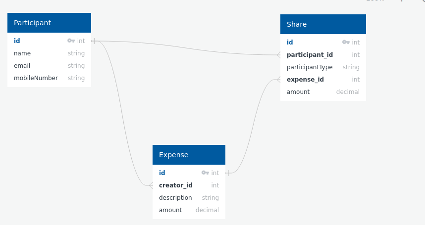

# Expense Management System

## Overview
This Expense Management System is designed to track and manage expenses among participants. It provides functionality for creating expenses, managing participants, and calculating shares.

## Class Structure and Patterns
Implemented mostly the DTO pattern and Facade Design pattern to adhere to open closed principle enabling the system to have more flexibility when adding multiple implementations

## Database Schema

## API Contracts
**teachment-exam-api-contracts**

The API contracts for this system are available in the root folder named `teachment-exam-api-contracts`, you can import it into your local Postman for further inspection. They provide detailed information about the endpoints, request payloads, and response payloads.

To access the API contracts, please refer to the files located in the `teachment-exam-api-contracts` folder.

